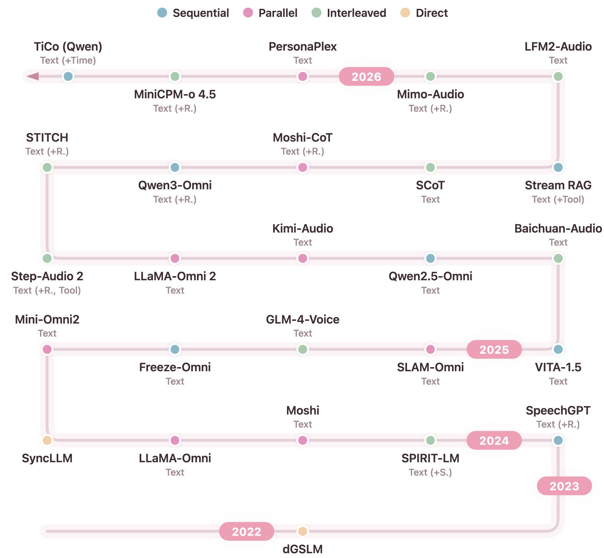
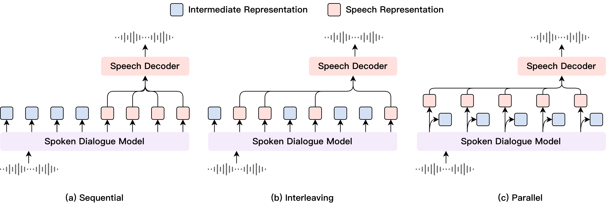

# Spoken Dialogue Models Survey

A survey of spoken dialogue models (SDMs) with **speech input** and **speech output**.

<p align="center">
  
</p>

### Intermediate Representation (IR)
Since the textless NLP paradigm (e.g., GSLM, dGSLM), it has been observed that directly modeling raw speech signals—even with phonetic or discrete speech tokens—remains challenging.
Modern SDMs usually introduce an intermediate representation (IR) for semantic planning, most commonly in the form of text. In addition to the direct guidance of the spoken content, Text IR can be extended with:
- **(+R.)** Reasoning (e.g., chain-of-thought, explicit thinking mode)
- **(+S.)** Style guidance for the spoken response
- **(+Tool)** Tool calling signals
- **(+Time)** Spoken Time Tokens for time-controlled speech generation

### Generation Pattern

The IR and speech tokens can be generated in different patterns, each with trade-offs in latency and speech–text conditioning:
- **Sequential** — Text first, then speech tokens. Chunking can potentially enable streaming generation.
- **Parallel** — Text and speech tokens generated simultaneously from shared representations. Delay patterns can improve quality.
- **Interleaved** — Text and speech tokens produced in a single mixed sequence, allowing direct conditioning of speech on text.

<p align="center">
  
</p>

### Speech Representation

SDMs generate speech tokens that are decoded into waveforms by a vocoder or speech codec decoder:
- **Phonetic tokens** — Quantized features from foundation speech encoders (e.g., HuBERT, Whisper). Capture linguistic content but lack speaker/style information; usually require a vocoder (e.g. Hifi-GAN) to condition on the speaker, style embedding for synthesis. Also called *semantic tokens*.
- **Acoustic tokens** — Derived from neural speech codecs via residual vector quantization (RVQ). Can be directly decoded into waveforms. Recent work distills phonetic/semantic information into early layers to preserve linguistic structure.

## Models

| Model | Date | IR | Speech Rep. | Pattern | Link | Notes |
|---|---|---|---|---|---|---|
| TiCo (Qwen) | 2026-03 | Text (+Time) | Acoustic token | Sequential |  [2603.22267](https://arxiv.org/abs/2603.22267) | Spoken Time Tokens enables time-controllable speech generation in SDMs |
| MiniCPM-o 4.5 | 2026-02 | Text (+R.) | Acoustic token | Interleaved | [MiniCPM-o](https://github.com/OpenBMB/MiniCPM-o) | TDM full-duplex model. Supports visual modality. No directly verified model-specific arXiv page found. |
| PersonaPlex | 2026-01 | Text | Acoustic token | Parallel | [2602.06053](https://arxiv.org/abs/2602.06053) | Follows the Moshi architecture. Dual-channel full-duplex model. |
| Mimo-Audio | 2025-12 | Text (+R.) | Acoustic token | Interleaved | [2512.23808](https://arxiv.org/abs/2512.23808) | Interleaves text tokens and “audio patches”, including a delay pattern. (arXiv title uses “MiMo-Audio”.) |
| LFM2-Audio | 2025-11 | Text | Acoustic token | Interleaved | [2511.23404](https://arxiv.org/abs/2511.23404) | Supports both interleaved and sequential patterns, adapting to different tasks. Covered in the broader LFM2 Technical Report. |
| Stream RAG | 2025-10 | Text (+Tool) | Acoustic token | Sequential | [2510.02044](https://arxiv.org/abs/2510.02044) | Enables the SDM to trigger tool queries in parallel with the user’s speech. (arXiv title uses “Stream RAG”.) |
| SCoT | 2025-10 | Text | Acoustic token | Interleaved | [2510.02066](https://arxiv.org/abs/2510.02066) | CoT framework for SDMs. Blockwise streaming full-duplex model. |
| Moshi-CoT | 2025-10 | Text (+R.) | Acoustic token | Parallel | [2510.07497](https://arxiv.org/abs/2510.07497) | CoT-tuned Moshi performs text reasoning in the “text monologue” stream to enable the “thinking while listening” paradigm. |
| Qwen3-Omni | 2025-09 | Text (+R.) | Acoustic token | Sequential | [2509.17765](https://arxiv.org/abs/2509.17765) | Thinker-Talker architecture. Supports explicit thinking mode, tool calling, and visual modality. |
| STITCH | 2025-07 | Text (+R.) | Phonetic token | Interleaved | [2507.15375](https://arxiv.org/abs/2507.15375) | Backbone: GLM-4-Voice. The paper discusses multiple interleaving patterns among text, reasoning, and speech. |
| Step-Audio 2 | 2025-07 | Text (+R., Tool) | Phonetic token | Interleaved | [2507.16632](https://arxiv.org/abs/2507.16632) | Uses multimodal RAG to support grounded responses and timbre/style control. |
| LLaMA-Omni 2 | 2025-05 | Text | Phonetic token | Parallel | [2505.02625](https://arxiv.org/abs/2505.02625) | Gate fusion of LLM hidden states and text tokens for improved speech quality. (arXiv title uses “LLaMA-Omni2”.) |
| Kimi-Audio | 2025-04 | Text | Phonetic token | Parallel | [2504.18425](https://arxiv.org/abs/2504.18425) | Shared LLM with a text head and an audio head. |
| Qwen2.5-Omni | 2025-03 | Text | Acoustic token | Sequential | [2503.20215](https://arxiv.org/abs/2503.20215) | Thinker-Talker architecture. Supports visual modality. |
| Baichuan-Audio | 2025-02 | Text | Acoustic token | Interleaved | [2502.17239](https://arxiv.org/abs/2502.17239) | Text-guided speech generation with an independent audio head. |
| VITA-1.5 | 2025-01 | Text | Acoustic token | Sequential | [2501.01957](https://arxiv.org/abs/2501.01957) | NAR + AR speech decoder taking the LLM embedding as input. |
| SLAM-Omni | 2024-12 | Text | Phonetic token | Parallel | [2412.15649](https://arxiv.org/abs/2412.15649) | “Semantic group modeling” enables generation of multiple phonetic tokens per text token. |
| GLM-4-Voice | 2024-12 | Text | Phonetic token | Interleaved | [2412.02612](https://arxiv.org/abs/2412.02612) | Single speech codebook paired with a flow-matching speech decoder. |
| Freeze-Omni | 2024-11 | Text | Acoustic token | Sequential | [2411.00774](https://arxiv.org/abs/2411.00774) | TDM-based full-duplex interaction; speech decoder conditioned on text tokens and LLM hidden states. |
| Mini-Omni2 | 2024-10 | Text | Acoustic token | Parallel | [2410.11190](https://arxiv.org/abs/2410.11190) | Parallel decoding with a delay pattern. |
| SyncLLM | 2024-09 | — | Phonetic token | Direct | [2409.15594](https://arxiv.org/abs/2409.15594) | Interleaves user speech and model speech for full-duplex dialogue. (arXiv title uses “Synchronous LLMs as Full-Duplex Dialogue Agents”.) |
| LLaMA-Omni | 2024-09 | Text | Phonetic token | Parallel | [2409.06666](https://arxiv.org/abs/2409.06666) | CTC speech decoder maps LLM response states to phonetic tokens for streaming speech synthesis. |
| Moshi | 2024-07 | Text | Acoustic token | Parallel | [2410.00037](https://arxiv.org/abs/2410.00037) | Dual-channel full-duplex model. Parallel decoding of text and acoustic tokens with a delay pattern. |
| SPIRIT-LM | 2024-02 | Text (+S.) | Phonetic token | Interleaved | [2402.05755](https://arxiv.org/abs/2402.05755) | Interleaves text and speech in one stream; the expressive version adds pitch and style tokens. (arXiv title uses “Spirit LM”.) |
| SpeechGPT | 2023-05 | Text (+R.) | Phonetic token | Sequential | [2305.11000](https://arxiv.org/abs/2305.11000) | Uses “Chain-of-Modality”. Expands the LLM vocabulary with phonetic tokens. |
| dGSLM | 2022-03 | — | Phonetic token | Direct | [2203.16502](https://arxiv.org/abs/2203.16502) | “Dual-tower” architecture for dual-channel full-duplex modeling. Direct modeling of two-channel phonetic tokens. 

## Citation

This survey is motivated by our paper [TiCo: Time-Controllable Training for Spoken Dialogue Models](https://arxiv.org/abs/2603.22267), which inserts Spoken Time Tokens into the intermediate representation of SDMs.

If you find this repo useful, please cite:

```bibtex
@article{chang2026tico,
      title={TiCo: Time-Controllable Training for Spoken Dialogue Models},
      author={Kai-Wei Chang and Wei-Chih Chen and En-Pei Hu and Hung-yi Lee and James Glass},
      journal={arXiv preprint arXiv:2603.22267},
      year={2026}
}
```
